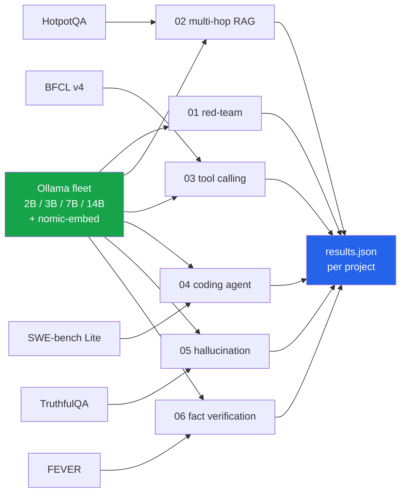

<h1 align="center">mcp-lab (MCP · LangChain · Ollama · FastAPI)</h1>
<p align="center"><i>Six agentic-AI projects on real benchmarks, running entirely on local models</i></p>

<p align="center">
  <a href="#the-six-projects">The six projects</a> &middot;
  <a href="docs/FINDINGS.md">Findings</a> &middot;
  <a href="docs/ARCHITECTURE.md">Architecture</a> &middot;
  <a href="docs/PROBLEMS.md">Problems hit</a> &middot;
  <a href="docs/LIMITATIONS.md">Limitations</a> &middot;
  <a href="docs/FUTURE.md">Future work</a>
</p>

<p align="center">
  
  
  
  
  
  <a href="LICENSE"></a>
</p>

---

Six self-contained projects, each built on a **real published benchmark** with **real
measured numbers**, running entirely on **local models** - no API keys, no paid inference,
no synthetic data standing in for a dataset.

Every project is built around a finding, not a feature. **Several of those findings are
negative**, and they are reported as they came out.

---

## The six projects

| # | Project | Benchmark | Headline finding |
|---|---|---|---|
| **01** | [MCP Red-Team Platform](projects/01_mcp_redteam_platform) | self-built, 5 audit modules | The same injection payload scores **0% in one delivery vector and 100% in another** |
| **02** | [Multi-Hop RAG Audit](projects/02_hotpotqa_multihop_rag) | HotpotQA | Retrieval finds the gold facts **83.6%** of the time, yet answer exact-match is **0.20** |
| **03** | [Tool-Calling Accuracy](projects/03_bfcl_tool_calling) | BFCL v4 | **87.9% &rarr; 64.3%** across the fleet, 700 real calls, zero errors |
| **04** | [SWE-bench Coding Agent](projects/04_swebench_coding_agent) | SWE-bench Lite | Both patches rejected by `git apply` - **malformed diff syntax, not wrong logic** |
| **05** | [Hallucination Rate](projects/05_truthfulqa_hallucination) | TruthfulQA | **Chain-of-thought made every model worse.** The 7B lost **35 points** |
| **06** | [Fact-Verification Agent](projects/06_fever_fact_verification) | FEVER | **38.3%** three-way verification against **live** Wikipedia |

Each project has its own README with the full method, complete results, and an honest
account of what broke while building it.

&#128202; **[All six findings, with the tables &rarr;](docs/FINDINGS.md)**

---

## The one worth reading first

**Chain-of-thought prompting made all five models worse on TruthfulQA.**

| Model | zero-shot | chain-of-thought | &Delta; |
|---|---:|---:|---:|
| qwen2.5:7b-instruct | **60%** | 25% | **-35 pts** |
| qwen2.5:3b-instruct | 45% | 23% | -22 pts |
| granite3.3:2b | 37% | 24% | -13 pts |
| llama3.2:3b | 36% | 22% | -14 pts |
| qwen2.5-coder:3b | 36% | 21% | -15 pts |

**Not one model improved.** CoT is near-universally recommended, and on this benchmark it is
actively harmful - the reasoning gives the model room to talk itself into the plausible
misconception that TruthfulQA is built to elicit.

---

## How the projects fit together



&#128295; **[Why each project has its own venv, and what is deliberately not shared &rarr;](docs/ARCHITECTURE.md)**

---

## Running a project

```bash
cd projects/03_bfcl_tool_calling
uv venv && uv pip install -e .
python run.py          # writes results.json
pytest -q
```

Each project directory is self-contained: its own `pyproject.toml`, its own venv, its own
tests, its own `results.json`.

### Requirements

- [Ollama](https://ollama.com) running locally, with at least one chat model pulled
- Python 3.11+
- Project 04 additionally needs **Docker** - it runs real repositories in a real sandbox

---

## 2026-09-16 · `qwen2.5-coder:14b` added to three projects

A 14B coder model was run against projects 03, 04 and 05. The three results
only mean something together.

| Project | 3B &rarr; 14B | vs a **3B instruct** |
|---|---|---|
| **03** tool calling | +27.1 pts | **loses by 11.4** |
| **05** truthfulness | +20 pts | **wins by 11** |
| **04** SWE-bench patches | failure mode changed, still fails | — |

**Scale helps when the task is bounded by knowledge, and does nothing when it
is bounded by a capability the tune lacks.** In 03 both coder models fall back
to scraping text on exactly the same 117 of 140 cases, because neither emits
Ollama's native `tool_calls` — 4.8x the parameters cannot add a capability. In
05, where the task is factual recall, the same jump is worth 20 points and the
14B tops the MC2 table outright.

Project 04 is the third shape: the 3B emitted diffs `git` could not parse, the
14B emits diffs that parse perfectly and cite line 1234 for code that lives at
line 1042. Scaling fixed the syntax and not the grounding.

Project 04's verdict is verified inside the Docker sandbox (`setup` exit 0,
baseline run, `git apply` rejected) and reproduces: asked twice, the model
emitted **different patches citing the same fabricated line numbers**, 1234 and
1000 both times.

---

## Input / Output

Project 05, the result that survives being checked hardest.


*Five models, one hundred questions, same sample, same seed. Chain of thought lowered
accuracy for every one of them, and lowered it most for the model that was best without
it — qwen2.5:7b-instruct fell 35 points, from clearly the strongest in the fleet to
level with a 2B.*

*TruthfulQA is built so that the plausible answer is the wrong one, and reasoning aloud
is a procedure for arriving at plausible answers. This is a result about that benchmark,
not a general argument against chain of thought.*

---

## Status

&#9989; All six built, tested and committed. **Every number in every README came from
running the code.**

&#128308; **Pending: the larger-model comparison on projects 01, 02 and 06.**
`qwen2.5-coder:14b` has been run on **03, 04 and 05** - the section above has those
results, including the answer to what was the open question here: project 04's patches
failed on diff *formatting*, and scaling fixed the syntax without fixing the grounding.
The remaining three gain a **comparison row** rather than being rewritten.

---

## Also worth reading

| | |
|---|---|
| &#128202; **[Findings](docs/FINDINGS.md)** | All six results with their tables |
| &#128295; **[Architecture](docs/ARCHITECTURE.md)** | Per-project venvs, what is shared, what is not |
| &#128736; **[Problems hit](docs/PROBLEMS.md)** | MCP 1.x vs 2.x, a template crash, 10,000 wasted embeddings |
| &#9888; **[Limitations](docs/LIMITATIONS.md)** | Sample sizes, single seeds, what these numbers do not show |
| &#128640; **[Future work](docs/FUTURE.md)** | Larger models, bigger samples, the comparisons worth running |
| &#128247; **[Screenshots](docs/SCREENSHOTS.md)** | How to capture and reference UI screenshots |

## Stack

`Model Context Protocol (MCP)` &middot; `LangChain` + `langchain-ollama` &middot; `Ollama`
&middot; `FastAPI` + `Jinja2` &middot; `httpx` &middot; `Hugging Face datasets` &middot;
`Pydantic` &middot; `Docker` &middot; `pytest` &middot; `uv`

## Keywords

agentic AI &middot; LLM agents &middot; Model Context Protocol &middot; MCP server &middot;
tool calling &middot; function calling &middot; BFCL &middot; HotpotQA &middot;
multi-hop RAG &middot; SWE-bench &middot; TruthfulQA &middot; FEVER &middot;
hallucination detection &middot; prompt injection &middot; red teaming &middot;
LLM security &middot; retrieval-augmented generation &middot; citation faithfulness
&middot; local LLM &middot; Ollama &middot; Qwen2.5 &middot; chain-of-thought &middot;
LLM evaluation &middot; benchmark reproducibility &middot; fact verification

## Licence

MIT - see [LICENSE](LICENSE).
